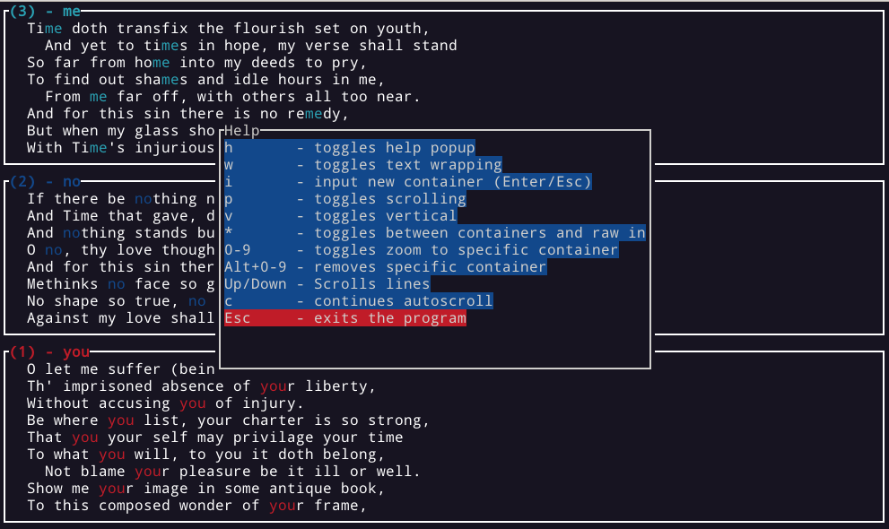
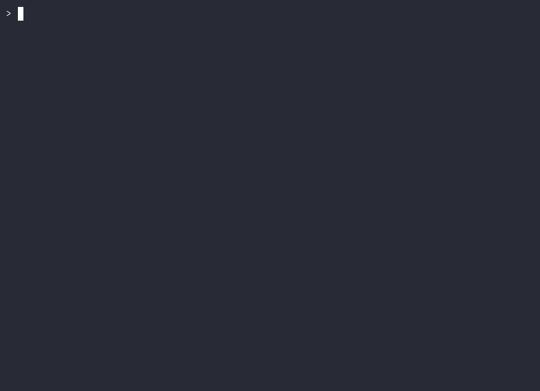
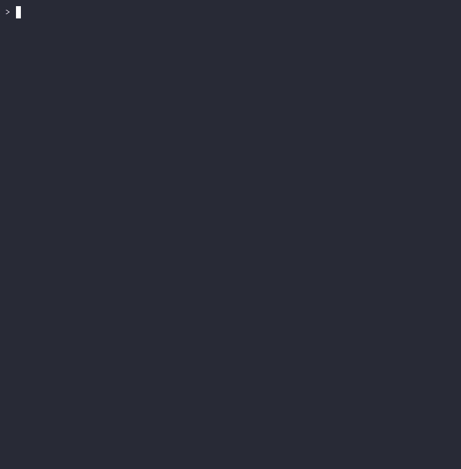

<h1 align="center">
  <br>
  
  <br>
  <br>
</h1>

<h5 align="center">logs splitter</h5>
<h4 align="center">A simple command line tool that helps you visualize an input stream of text.</h4>



<p align="center">
  
  
</p>

<p align="center">
  <a href="#key-features">Key Features</a> •
  <a href="#usage">Usage</a> •
  <a href="#screenshots">Screenshots</a> •
  <a href="#download">Download</a> •
  <a href="#roadmap">Roadmap</a> •
  <a href="#license">License</a>
</p>

## Key Features

* Select render/stream speed
* Automatic color assigned to each string match
* Vertical and Horizontal view
* Pause and continue stream
* Scroll Up/Down
* Delete containers on runtime
* Add new containers on runtime
* Dedicated container for raw stream
* Toggle line wraping
* Zoom into a specific container


## Usage

  ```sh
  $ logss -h
  Simple cli command to show logs in a friendly way

  Usage: logss [OPTIONS]

  Options:
    -c, --contains <CONTAINERS>  Finds the substring
    -r, --render <RENDER>        Defines render speed in milliseconds [default: 100]
    -h, --help                   Print help
    -V, --version                Print version
  
  $ cat shakespeare.txt | logss -c to -c be -c or
  ```

## Screenshots

<details>
  <summary>Zooms</summary>

  

</details>
<details>
  <summary>Pause</summary>

  

</details>
<details>
  <summary>Vertical toggle</summary>

  

</details>
<details>
  <summary>Dynamic input and removal</summary>

  

</details>

## Download

Pre compiled binaries for several platforms can be downloaded from the [release](https://github.com/todoesverso/logss/releases) section.

## Roadmap

This is just a personal project intended to learn Rust, so things move slowly. 
Currently it is a Alpha release because there are several things missing but it works and can be useful for someone.

This is a list of things I plan to do:

* Add documentation (the rust way)
* Refactoring (as I learn more Rust things)
* Tests
* Container hide/show
* Accept regexp
* Configuration file (to start with a predefined state)
* Smart timestamp highlights
* ... whatever I can think of when I am using it

## License

MIT
